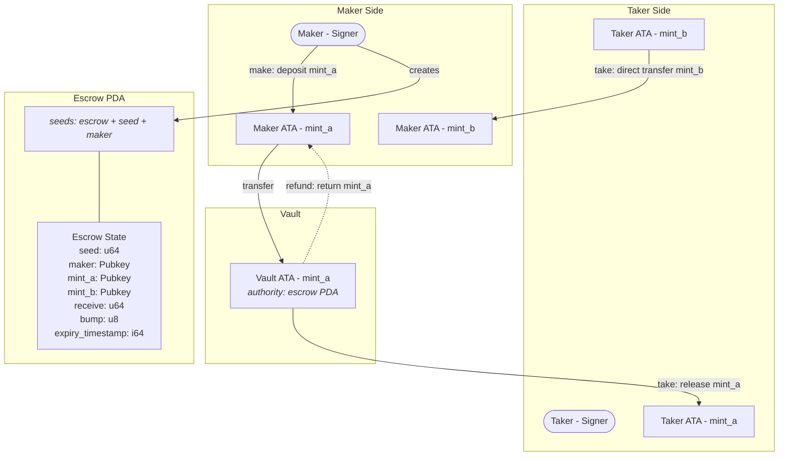

# Escrow Program on Solana

A Solana program built with Anchor that enables trustless, time-locked token swaps between two parties. A maker deposits SPL tokens into a PDA-controlled vault and specifies a desired token and amount in return. Any taker can fulfill the swap before the expiry deadline, or the maker can cancel and reclaim their tokens at any time.

---

## What's Inside

### Program Instructions

| Instruction                                     | What it does                                                                                           |
| ----------------------------------------------- | ------------------------------------------------------------------------------------------------------ |
| `make(seed, receive, amount, expiry_timestamp)` | Creates an escrow PDA, initializes a vault, and deposits `amount` of token A from the maker            |
| `take`                                          | Fulfills the swap: taker sends `receive` of token B to maker, receives all vault tokens (expiry-gated) |
| `refund`                                        | Cancels the escrow: returns vault tokens to maker and closes all accounts (maker-gated)                |

### Architecture



### Error Codes

| Error           | When it triggers                                            |
| --------------- | ----------------------------------------------------------- |
| `EscrowExpired` | Taker attempts to fulfill a swap after the expiry timestamp |
| `InvalidAmount` | Maker provides zero for `amount` or `receive`               |
| `InvalidExpiry` | Maker sets an expiry timestamp that is in the past          |

---

## Tech Stack

- **Language** - Rust (toolchain `1.89.0`)
- **Framework** - [Anchor](https://www.anchor-lang.com/) v1.0.0
- **Token Support** - SPL Token via `anchor-spl`
- **Testing** - [LiteSVM](https://github.com/LiteSVM/litesvm) (fast local Solana VM, no validator needed)
- **Network** - Localnet (configurable in `Anchor.toml`)

---

## Prerequisites

1. **Rust** installed via [rustup](https://rustup.rs/) (toolchain 1.89.0 is pinned in `rust-toolchain.toml`)
2. **Solana CLI** installed (v2.x):
   ```bash
   sh -c "$(curl -sSfL https://release.anza.xyz/stable/install)"
   ```
3. **Anchor CLI** installed (v1.0.0+):
   ```bash
   cargo install --git https://github.com/coral-xyz/anchor avm --force
   avm install latest
   avm use latest
   ```
4. **Node.js** installed (for Anchor workspace tooling)
5. A Solana keypair at the default path:
   ```
   ~/.config/solana/id.json
   ```

---

## Getting Started

```bash
# Clone the repo
git clone https://github.com/Deep-Thakkar-1910/Turbine_assignment3_escrow.git escrow
cd escrow

# Install JS dependencies
npm install

# Build the program
anchor build

# Run tests
anchor test
```

---

## Tests

Tests are written in Rust using LiteSVM for fast local execution without spinning up a validator.

| Test                            | What it verifies                                                                                          |
| ------------------------------- | --------------------------------------------------------------------------------------------------------- |
| `test_make_and_take`            | Full swap lifecycle: maker deposits 1 token A, taker sends 2 token B, verify final balances on both sides |
| `test_make_and_refund`          | Maker deposits tokens, cancels the escrow, verifies tokens are returned and accounts are closed           |
| `test_take_after_expiry`        | Creates escrow with future expiry, warps clock past it, confirms `take` fails with `EscrowExpired`        |
| `test_make_with_invalid_amount` | Attempts to create escrow with zero amounts, confirms `InvalidAmount` error                               |

### Running Tests

```bash
anchor test
```

---

## Project Structure

```
escrow/
├── programs/escrow/
│   ├── src/
│   │   ├── lib.rs              # Program entrypoint and instruction dispatch
│   │   ├── state.rs            # Escrow account definition
│   │   ├── constants.rs        # PDA seed constants
│   │   ├── error.rs            # Custom error codes
│   │   └── instructions/
│   │       └── mod.rs
│   │       ├── make.rs         # Escrow creation and token deposit
│   │       ├── take.rs         # Swap fulfillment with expiry check
│   │       └── refund.rs       # Escrow cancellation and token refund
│   └── tests/
│       └── test_initialize.rs  # LiteSVM integration tests
├── Anchor.toml
├── Cargo.toml
├── package.json
└── README.md
```

---

## Program ID

```
58AGNg2soLw1k8eBGMA3MLubjCaDqedyawUaCWZg2EPA
```

---
